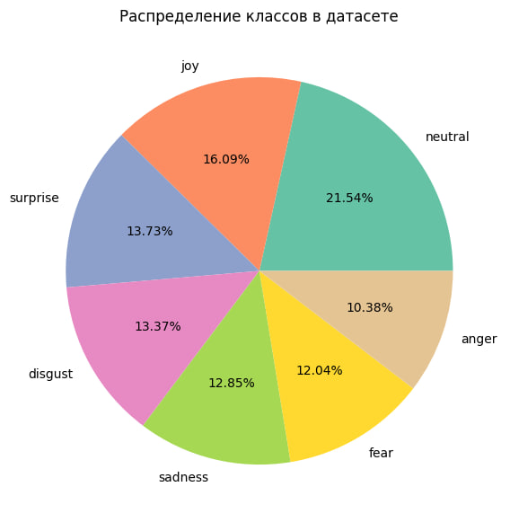

# Датасет эмотивной разметки from_RNC_with_love

В создании датасета использовались материалы корпуса [Русской классики НКРЯ](https://ruscorpora.ru/search?search=CgQyAggV). Датасет включает в себя 2716 примеров реплик, ярко выражающих одну из следующих эмоций:

- neutral
- joy
- surprise
- fear
- sadness
- disgust
- anger

Датасет состоит из следующих колонок:

- id_replic (int): id реплики
- replic (str): реплика без прямой речи
- html_text (str): реплика с прямой речью, речь автора <i>в тэге</i>
- sentiment (str): эмотивный класс

На материале датасета и на базе [этой модели](https://huggingface.co/cointegrated/rubert-tiny2-cedr-emotion-detection) была дообучена multiclass classification модель. [Ссылка на huggingface](https://huggingface.co/kplro/rubert-tiny2-cedr-rnc-emotion-detection). Процесс дообучения представлен в emotive_detection_model.ipynb

Метрики качества модели на тестовом датасете:
|  |  fear | sadness | neutral  |  joy  |  disgust  |  anger  |	surprise  |
|----------|----------|----------|----------|----------|----------|----------|----------|
| precision    | 1 | 1 | 1  |  1  |  1  |  0  |	1  |
| recall    | 0,21  |	0,58  |	0,39  |	0,70  |	0,29  |	0,00  |	0,57  |
| f1_weighted    | 0,34  |	0,73  |	0,56  |	0,83  |	0,45  |	0,00  |	0,72  |
| f1_micro    | 0,21  |	0,58  |	0,39  |	0,70  |	0,29  |	0,00  |	0,57  |
| f1_macro    | 0,05  |	0,12  |	0,08  |	0,12  |	0,06  |	0,00  |	0,12  |

---

# Emotion detection dataset from_RNC_with_love

The materials of the [Russian Classics of the Russian National Corpus](http://ruscorpora.ru/search?search=CgQyAggV) corpus were used to create the dataset. The dataset includes 2,716 examples of dialogue utterances that vividly express one of the following emotions:

- neutral
- joy
- surprise
- fear
- sadness
- disgust
- anger

The emotions in the dataset have the following distribution:

The dataset consists of the following columns:

- id_replica (int): replica id
- replica (str): an utterance without direct speech
- html_text (str): an utterance with the author's direct speech, the speech of the author <i> in the tag</i>
- sentiment (str): emotive class

[This model](https://huggingface.co/cointegrated/robert-tiny 2-edr-motion-detection) was finetuned on the dataset for the multiclass classification task. The fine-tuned model is available [on huggingface](https://huggingface.co/kplro/rubert-tiny2-cedr-rnc-emotion-detection). The fine-tuning process is presented in **emotive_detection_model.ipynb**

Finetuned model quality metrics on the test dataset:
|  |  fear | sadness | neutral  |  joy  |  disgust  |  anger  |	surprise  |
|----------|----------|----------|----------|----------|----------|----------|----------|
| precision    | 1 | 1 | 1  |  1  |  1  |  0  |	1  |
| recall    | 0,21  |	0,58  |	0,39  |	0,70  |	0,29  |	0,00  |	0,57  |
| f1_weighted    | 0,34  |	0,73  |	0,56  |	0,83  |	0,45  |	0,00  |	0,72  |
| f1_micro    | 0,21  |	0,58  |	0,39  |	0,70  |	0,29  |	0,00  |	0,57  |
| f1_macro    | 0,05  |	0,12  |	0,08  |	0,12  |	0,06  |	0,00  |	0,12  |
